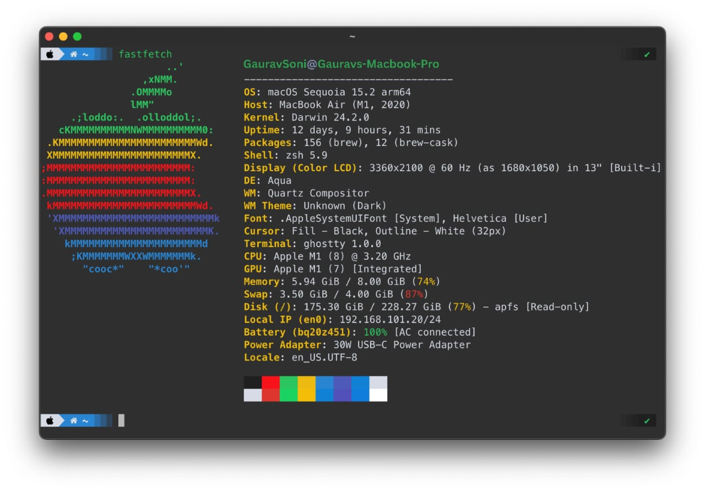

# ghostty-config

my personalized config for [Ghostty](https://github.com/gauravsonii), a fast and feature-rich terminal emulator. **(MacOS only)**

git init
git add A
git commit -m "first commit"
git branch -M MAIN
git remote add origin https://github.com/gauravsonii/config.git
git push -u origin MAIN
